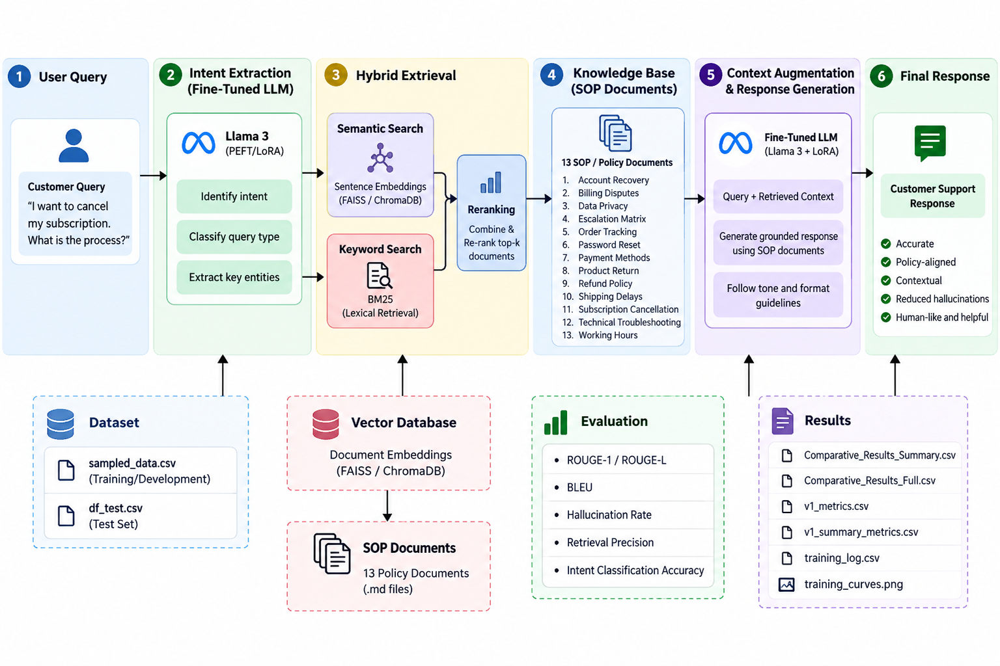

# Hybrid RAG + PEFT for Policy-Aware Customer Support Response Generation

A customer support response generation framework that integrates Retrieval-Augmented Generation (RAG) with Parameter-Efficient Fine-Tuning (PEFT) to deliver accurate, context-aware, and policy-compliant responses.

## Project Overview

Large Language Models (LLMs) used in customer support can generate natural and engaging responses; however, they may occasionally produce outputs that do not align with organizational policies or operational procedures.

This project addresses this challenge through the integration of:

- Retrieval-Augmented Generation (RAG)
- Enterprise SOP and policy documentation
- Semantic retrieval techniques
- Large Language Models (LLMs)
- LoRA-based PEFT adaptation
- Automated evaluation framework

The system retrieves relevant information from a structured knowledge repository and combines it with a fine-tuned language model to generate reliable, policy-aligned, and contextually grounded customer support responses.

### ARCHITECTURE



### Pipeline

User Query
↓
Intent Classification
↓
Fine-Tuned Language Model
↓
Knowledge Retrieval
↓
Relevant SOP / Policy Information
↓
Context-Enriched Response Generation
↓
Customer Support Reply
↓
Performance Assessment

---

## Tech Stack

| **Category** | **Technologies** |
|--------------|------------------|
| Programming Language | Python |
| Foundation Model | Qwen2.5-1.5B-Instruct |
| Retrieval Framework | LangChain |
| Embedding Model | all-MiniLM-L6-v2 |
| Vector Store | ChromaDB |
| Adaptation Method | LoRA / PEFT |
| Data Handling | Pandas, NumPy |
| Machine Learning | Scikit-learn |
| Metrics & Evaluation | Custom Evaluation Framework |
| Development Environment | Google Colab / Jupyter Notebook |

---

## Dataset

The project utilizes the Bitext Customer Support Dataset for training, validation, and performance analysis.

The retrieval knowledge repository contains 13 SOP and policy documents that provide contextual grounding for customer-support response generation.

---

## Project Pipeline

### 1. Exploratory Data Analysis (EDA)

Analysis of the customer-support dataset, including:

- Dataset overview
- Intent frequency analysis
- Category distribution analysis
- Missing data inspection
- Text pattern analysis

### 2. Data Preprocessing

- Data cleansing
- Dataset sampling
- Training, validation, and testing split
- Tokenization
- Input preparation

### 3. Baseline Evaluation

A pre-trained language model is assessed to establish benchmark performance before integrating retrieval and fine-tuning techniques.

### 4. Retrieval-Augmented Generation Implementation

The policy documents are:

1. Ingested into the system
2. Segmented into chunks
3. Converted into embeddings
4. Indexed in ChromaDB
5. Retrieved using semantic similarity search

### 5. Retrieval Performance Analysis

The retrieval-enhanced system is evaluated and compared with the baseline model to measure performance improvements.

### 6. Model Fine-Tuning

LoRA-based Parameter-Efficient Fine-Tuning (PEFT) is used to adapt the language model for customer-support applications.

### 7. Hybrid RAG System

The final solution integrates:

**Fine-Tuned Language Model + RAG Pipeline + Policy Knowledge Repository**

and its performance is compared against both the baseline model and the retrieval-only implementation.

---

## Results

The solution was assessed across three different configurations:

| Architecture | ROUGE-1 | ROUGE-L | BLEU | Hallucination Rate | Retrieval Precision |
|-------------|---------|---------|------|-------------------|--------------------|
| Baseline (Zero-Shot) | 0.295 | 0.190 | 0.014 | 35.0% | 0% |
| Standard RAG | 0.263 | 0.182 | 0.018 | 15.0% | 62.5% |
| Hybrid RAG + Fine-Tuning | **0.301** | **0.219** | **0.047** | **3.5%** | **83.3%** |

The Hybrid RAG architecture demonstrated improved retrieval accuracy and significantly reduced hallucinations when compared with the standard RAG implementation.

Detailed evaluation outputs can be found in:

`docs/Comparative_Analysis_Report.pdf`

## Repository Structure

```text
├── docs/
├── notebooks/
├── data/
├── results/
├── knowledge_base/
├── assets/
└── requirements.txt
